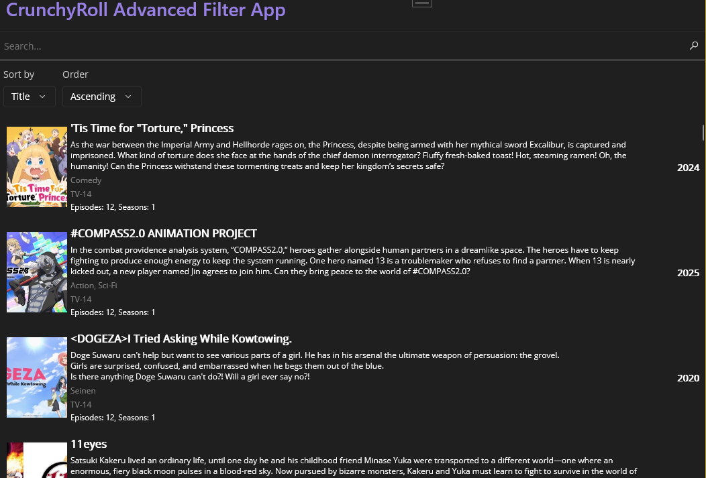

# CrunchyRollAdvancedFilterApp
Simple .Net Maui app for displaying all animes on CrunchyRoll with advanced filter and sorting possibilities. I created this app, because i cannot sort or filter by count of episodes inside CrunchyRoll.
You can sort by:
- "Title"
- "Description"
- "Genres"
- "Episodes"
- "Seasons"
- "Year"

The app looks like this:
